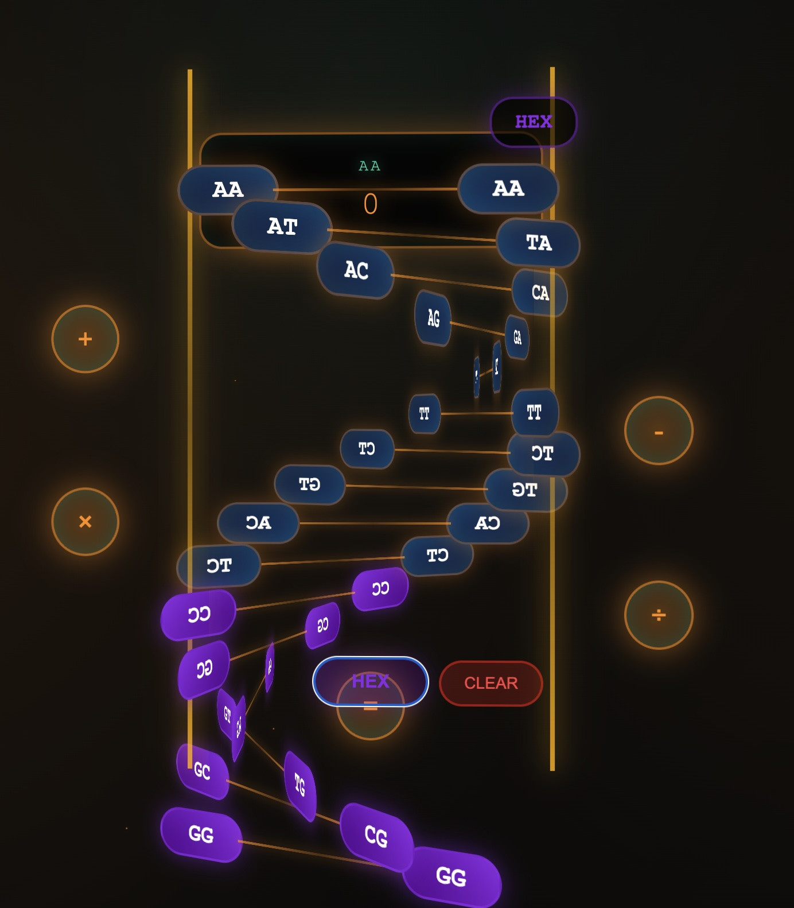

# 创意计算器设计集合

这里收集了9个独特风格的网页计算器，每个都有其独特的视觉设计和交互体验。从经典的赛博朋克风格到创新的太阳系主题，每个计算器都是功能与艺术的完美结合。

## 📋 目录

1. [赛博朋克矩阵计算器](#1-赛博朋克矩阵计算器)
2. [新拟态软UI计算器](#2-新拟态软ui计算器)
3. [迷幻万花筒计算器](#3-迷幻万花筒计算器)
4. [3D全息立方体计算器](#4-3d全息立方体计算器)
5. [DNA双螺旋生物计算器](#5-dna双螺旋生物计算器)
6. [太阳系行星计算器](#6-太阳系行星计算器)
7. [音乐合成器计算器](#7-音乐合成器计算器)
8. [海洋水下计算器](#8-海洋水下计算器)
9. [电路板电子计算器](#9-电路板电子计算器)

---

## 1. 赛博朋克矩阵计算器

**文件**: `cyberpunk_matrix_calculator.html`

### 🎨 设计特点
- **主题**: 黑客帝国/赛博朋克风格
- **配色**: 经典绿色荧光字体（#0f0）配黑色背景
- **特效**: 
  - 矩阵代码雨背景动画
  - CRT显示器扫描线效果
  - ASCII艺术标题
  - 绿色荧光发光效果

### 💻 使用方法
- 标准计算器布局，支持基本四则运算
- 按钮悬停时有荧光增强效果
- 点击按钮时有脉冲动画
- 支持键盘输入

---

## 2. 新拟态软UI计算器

**文件**: `neumorphic_soft_ui_calculator.html`

### 🎨 设计特点
- **主题**: 现代软UI/新拟态设计
- **配色**: 浅灰背景（#e0e0e0）配橙色强调色（#ff9500）
- **特效**:
  - 柔和的内外阴影创造3D深度
  - 按钮按下时的凹陷效果
  - 平滑的过渡动画
  - 无边框的现代感

### 💻 使用方法
- 清晰的按钮层次，数字键和功能键视觉分离
- 操作按钮使用橙色突出显示
- 按钮交互有明显的深度变化反馈

---

## 3. 迷幻万花筒计算器

**文件**: `psychedelic_kaleidoscope_calculator.html`

### 🎨 设计特点
- **主题**: 60-70年代迷幻艺术风格
- **配色**: 彩虹渐变色彩（品红、青色、黄色等）
- **特效**:
  - 旋转的万花筒背景
  - 扎染色彩效果
  - 螺旋图案动画
  - 呼吸和旋转动画
  - Righteous复古字体

### 💻 使用方法
- 色彩丰富的按钮设计
- 按钮悬停时有彩虹光晕效果
- 背景持续变换创造沉浸体验

---

## 4. 3D全息立方体计算器

**文件**: `3d_holographic_cube_calculator.html`

### 🎨 设计特点
- **主题**: 未来科技全息界面
- **配色**: 青色全息光（cyan）配橙色强调（#ff6600）
- **特效**:
  - 3D旋转立方体结构
  - 全息投影效果
  - 星空背景
  - 发光边缘和顶点
  - 透视变换动画

### 💻 使用方法
- 立方体的每个面显示不同功能
- 可拖拽旋转立方体
- 数字浮现在立方体表面
- 计算时立方体会戏剧性旋转

---

## 5. DNA双螺旋生物计算器

**文件**: `dna_helix_bio_calculator.html`  
**详细文档**: `README_dna-calculator.md`

### 🎨 设计特点
- **主题**: 生物科技/基因工程风格
- **配色**: 橙色磷酸骨架配深色核苷酸
- **特效**:
  - 3D旋转DNA双螺旋
  - 生物发光效果
  - 细胞背景和漂浮粒子
  - 突变和复制动画

### 💻 使用方法
- **独特功能**: 支持十进制/十六进制切换
- **碱基对映射**:
  - 十进制：10个碱基对代表0-9
  - 十六进制：16个碱基对代表0-F
- 点击碱基对输入数字
- 运算时触发DNA剪接动画
- 结果显示为遗传序列

### 🔬 特殊功能
- **DEC/HEX切换**: 在10进制和16进制间切换
- **遗传序列显示**: 数字转换为DNA碱基对
- **负数处理**: 显示为"(-) + 碱基序列"

---

## 6. 太阳系行星计算器

**文件**: `solar_system_planetary_calculator.html`

### 🎨 设计特点
- **主题**: 宇宙太阳系主题
- **配色**: 各行星独特的渐变色彩
- **特效**:
  - 行星围绕太阳轨道运行
  - 点击时光束射向太阳
  - 太阳持续脉动发光
  - 计算时触发太阳耀斑

### 💻 使用方法
- 数字0-9表示为不同行星
- 彗星和小行星代表运算符
- 悬停显示引力场效果
- 行星点击时发光并发射光束

---

## 7. 音乐合成器计算器

**文件**: `music_synthesizer_piano_calculator.html`

### 🎨 设计特点
- **主题**: 音乐合成器/钢琴键盘
- **配色**: 彩虹渐变按键效果
- **特效**:
  - 每个数字对应不同音符
  - 可视化声波动画
  - 频率分析器显示
  - 计算时播放音乐和弦

### 💻 使用方法
- 点击数字键播放音符
- 运算符触发和弦音效
- 音量滑块兼作内存功能
- 支持键盘输入

---

## 8. 海洋水下计算器

**文件**: `ocean_underwater_bubble_calculator.html`

### 🎨 设计特点
- **主题**: 海底世界
- **配色**: 海洋蓝绿色调
- **特效**:
  - 数字按钮如气泡上下浮动
  - 游动的鱼群动画
  - 水波纹扩散效果
  - 海草摇曳动画

### 💻 使用方法
- 气泡按钮点击产生涟漪
- 悬停时生物发光效果
- 计算时鱼群游过
- 深度计显示历史记录

---

## 9. 电路板电子计算器

**文件**: `circuit_board_electronics_calculator.html`

### 🎨 设计特点
- **主题**: 电子电路板
- **配色**: 经典绿色LED配橙色焊点
- **特效**:
  - 启动时系统引导动画
  - 电流脉冲传输效果
  - 焊点发光动画
  - 计算时电涌火花效果

### 💻 使用方法
- LED段显示数字
- 电子元件符号作为运算符
- 点击时电路轨迹发光
- 错误时短路闪烁效果

---

## 🚀 快速开始

1. 直接在浏览器中打开任意HTML文件
2. 无需安装依赖，所有样式和脚本都内嵌
3. 支持现代浏览器（Chrome、Firefox、Safari、Edge）

## 💡 技术特点

- **纯前端实现**: HTML + CSS + JavaScript
- **无外部依赖**: 完全独立运行
- **响应式设计**: 适配不同屏幕尺寸
- **流畅动画**: 使用CSS3动画和过渡效果
- **键盘支持**: 大部分计算器支持键盘输入

## 🎨 设计理念

每个计算器都探索了不同的设计方向：
- **功能与美学的平衡**: 保持计算器核心功能的同时追求视觉创新
- **沉浸式体验**: 通过动画和交互创造独特的使用体验
- **主题一致性**: 每个设计都保持高度的视觉统一性

---

*这些计算器展示了网页技术在创意表达上的无限可能，将日常工具转变为艺术品。*